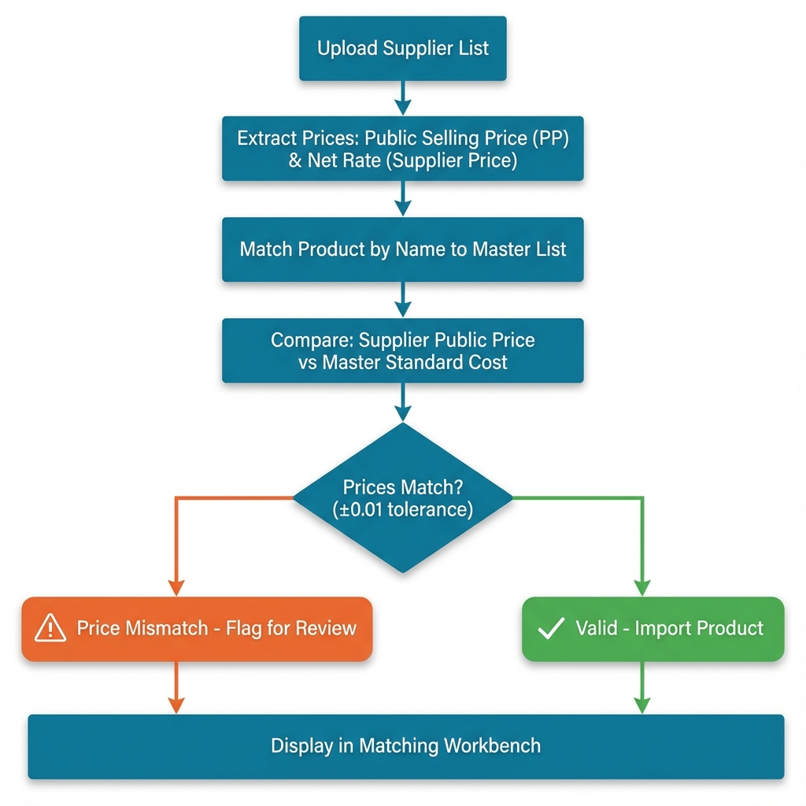
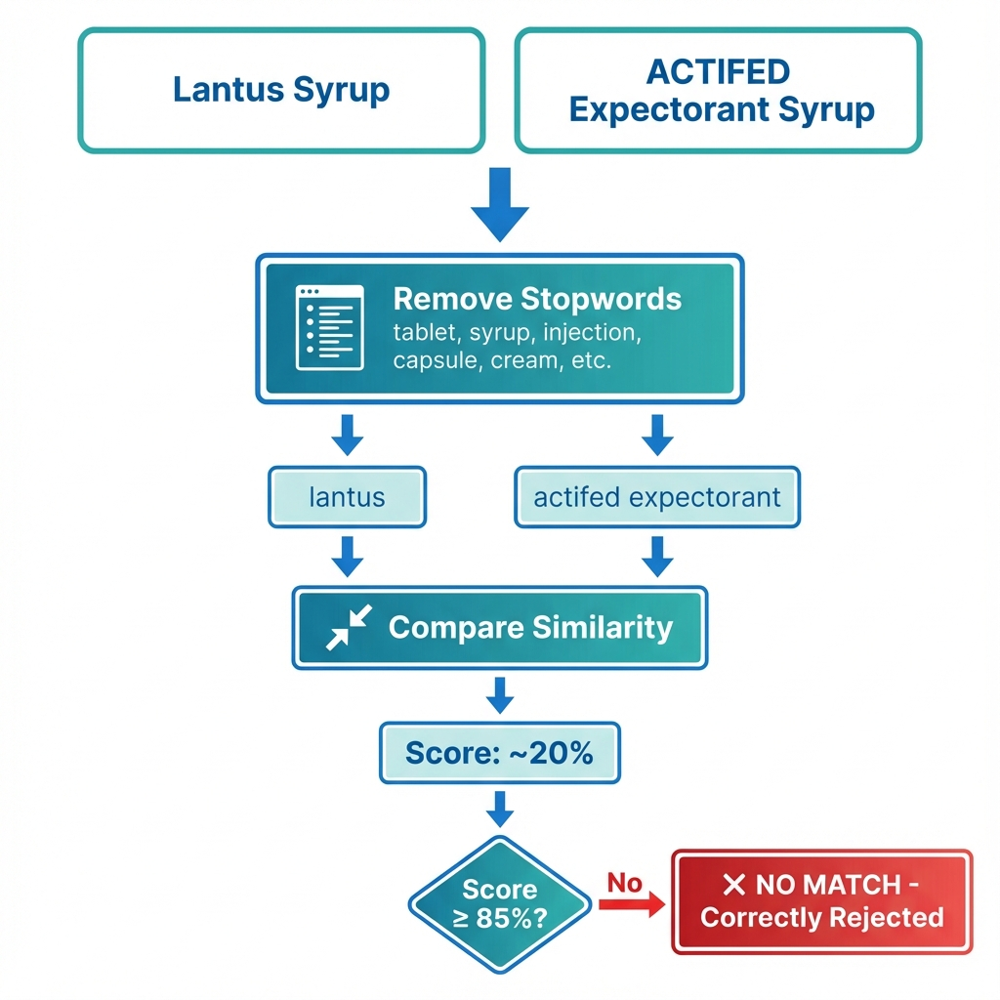

# 📖 Pharma-Procure Optimizer - User Guide Addendum (v2.1)

This addendum covers the new features added in version 2.1. For the complete user guide, see the main USER_GUIDE.md document.

---

## 🆕 New Features in v2.1

### 1. PDF to Excel Converter

Convert PDF supplier price lists directly within the application without needing external tools.

#### How to Use

1. **Navigate** to the "Upload & Process" tab
2. **Scroll down** to find "📄 Convert PDF Supplier List to Excel" section
3. **Click** to expand the section
4. **Upload** your PDF file (supports multi-page PDFs)
5. **Review** the auto-extracted data preview
6. **Map columns** to required fields:
   - Product Name (required)
   - Public Selling Price (optional)
   - Net Rate (required)
   - Pack Size, Bonus, Expiry, Credit Terms (optional)
7. **Click** "Convert to Excel" button
8. **Download** the generated Excel file
9. **Upload** the Excel file as a regular supplier list


**Key Features**:
- Automatic table extraction from multi-page documents
- Smart detection and removal of repeated headers
- Auto-suggestions for column mapping
- Supports various PDF formats (including MOH price lists)

---

### 2. Public Selling Price Validation

Track official regulated public selling prices separately from supplier net rates.

#### Understanding the Two Prices

**Public Selling Price (PP AED)**:
- Official price regulated by authorities
- What customers pay at pharmacy
- Must be consistent across ALL suppliers
- Example: Panadol 500mg = 25.00 AED (fixed)

**Net Rate (Supplier Price)**:
- What pharmacy pays the supplier (wholesale)
- Varies by supplier, deals, and negotiations
- Example: Supplier A = 20.00 AED, Supplier B = 19.50 AED

#### How It Works

The system validates that suppliers aren't charging different public prices than what's registered in the master list, ensuring regulatory compliance.



#### Column Mapping Updates

When uploading supplier lists, you'll now see TWO price fields:

- **💵 Public Selling Price (PP AED)** - Optional but recommended
- **💰 Net Rate (Supplier Price)** - Required

#### Price Validation Results

After upload, the system shows:
- ✅ "All prices validated" - No issues found
- ⚠️ "X products have price mismatches" - Review needed

#### Reviewing Price Mismatches

1. Go to "Matching Workbench" tab
2. Select "Price Mismatch" from the filter dropdown
3. Review the comparison table:
   - **Net Rate**: What you pay supplier
   - **Public Price**: Supplier's stated public price
   - **Master Price**: Official price from master list
   - **Price ✓**: Match status (✅/❌/—)

**Price Match Icons**:
- ✅ = Prices match (within 0.01 AED tolerance)
- ❌ = Price mismatch detected
- — = Missing price data

**What to Do About Mismatches**:
- Contact supplier to correct their price list
- Verify master list is up-to-date
- Document exceptions if legitimate

---

### 3. Enhanced Product Matching

Significantly improved matching accuracy to prevent false positives.

#### The Problem (Before v2.1)

Products were matching incorrectly:
- "Lantus Syrup" matched "ACTIFED Syrup" ❌
- "Betadine Tablet" matched "DIAXINE Tablets" ❌

**Why?** They were matching based ONLY on "Syrup" or "Tablet" - not the actual drug name!

#### The Solution (v2.1)

**1. Stricter Thresholds**
- Minimum similarity increased from 70-75% to **85-90%**
- Products must be very similar to match

**2. Pharmaceutical Stopword Filtering**
Added **50+ common terms** that are now ignored during matching:

**Dosage Forms**:
- tablet, capsule, syrup, injection, solution
- cream, ointment, gel, lotion, drops, spray
- powder, granules, vial, ampoule, inhaler
- suppository, patch, film

**Packaging Terms**:
- bottle, box, blister, strip, tube, pack, jar

**Common Descriptors**:
- mg, ml, gm, mcg, iu, per, each, unit

#### How Stopword Filtering Works



**Example**:

**Before Filtering**:
- Supplier: "Lantus Syrup"
- Master: "ACTIFED Expectorant Syrup"

**After Removing Stopwords**:
- Supplier: "lantus"
- Master: "actifed expectorant"

**Similarity Score**: ~20% (Too low!)

**Result**: ✗ NO MATCH (Correctly rejected)

#### Benefits

1. **No False Positives**: Products only match on drug name, not formulation
2. **Higher Precision**: 85-90% similarity ensures accuracy
3. **Pharmaceutical Focus**: Stopwords list tailored for pharmacy products
4. **Better Unmatched Items**: Genuine unmatches, not false positives

---

## 📊 Updated Workflow

### Complete Supplier Upload Workflow

```
1. Prepare Supplier List
   ├─→ Excel/CSV format
   └─→ OR convert from PDF using built-in converter

2. Upload to System
   ├─→ Map Product Name column
   ├─→ Map Public Selling Price (PP AED) - optional
   ├─→ Map Net Rate (Supplier Price) - required
   └─→ Map Pack Size, Bonus, Expiry (optional)

3. Automatic Processing
   ├─→ Remove pharmaceutical stopwords
   ├─→ Match products (85%+ similarity required)
   ├─→ Validate public prices (±0.01 tolerance)
   └─→ Store data

4. Review Results
   ├─→ Check upload summary
   ├─→ Review price mismatch warnings
   └─→ Go to Matching Workbench for details

5. Manual Actions (if needed)
   ├─→ Link unmatched products manually
   ├─→ Contact suppliers about price discrepancies
   └─→ Update master list if needed
```

---

## ⚙️ Configuration Options (config.py)

For advanced users, you can customize matching behavior in `config.py`:

### Matching Thresholds
```python
MATCH_CUTOFF_TOKEN_SORT = 85    # Token sort minimum (default: 85)
MATCH_CUTOFF_TOKEN_SET = 85     # Token set minimum (default: 85)
MATCH_CUTOFF_PARTIAL = 90       # Partial match minimum (default: 90)
```

**Higher = Stricter** (fewer matches, more precision)
**Lower = Lenient** (more matches, less precision)

### Stopwords List
```python
PHARMA_STOPWORDS = [
    'tablet', 'syrup', 'injection',  # Add or remove terms
    # ... 50+ terms total
]
```

You can add industry-specific terms or remove ones that are meaningful in your context.

---

## 🆘 Troubleshooting

### "Too Many Unmatched Products"
**Solution**: The stricter matching may leave more products unmatched. This is intentional for accuracy.
- Review unmatched items in Matching Workbench
- Use manual linking for genuine products
- Create Product Aliases for common variations

### "PDF Converter Not Finding Tables"
**Solution**: Ensure your PDF contains actual tables, not scanned images.
- PDFs must be text-based (not scanned images)
- Tables should be clearly formatted
- Try converting with different column settings

### "All My Prices Show Mismatches"
**Solution**: Check if your supplier provides public price in their list.
- Public Price field is optional
- If not provided, validation shows "—" (unknown)
- Only flags as ❌ mismatch if prices are provided AND different

---

## 💡 Best Practices

### For Accurate Matching
1. **Use Full Product Names**: Include strength and formulation
2. **Consistent Formatting**: Standardize your master list naming
3. **Create Aliases**: For products with multiple valid names
4. **Review Regularly**: Check Matching Workbench after each upload

### For Price Compliance
1. **Always Include Public Price**: Even in supplier uploads
2. **Review Mismatches Promptly**: Don't ignore price validation warnings
3. **Document Exceptions**: Keep records of legitimate price variations
4. **Update Master List**: When official prices change

### For PDF Conversion
1. **Text-Based PDFs Only**: Scanned images won't work
2. **Check Preview**: Always review extracted data before converting
3. **Verify Column Mapping**: Don't rely solely on auto-detection
4. **Test with Sample**: Try a few pages before converting large files

---

## 📈 What's Next

Future planned enhancements:
- Bulk alias creation from matching workbench
- Historical price tracking and trends
- Automated supplier performance scoring
- Excel template generator for suppliers
- Batch PDF processing

---

For questions or issues, refer to the main [README](README.md) or [CHANGELOG](CHANGELOG.md).
